# ⛏️ AI-Based Smart Governance & Compliance Monitoring System for Coal Mines

> **Smart India Hackathon 2026 — SIH26024**  
> **Organization:** Ministry of Coal  
> **Department:** Coal India Limited  
> **Category:** Software  
> **Theme:** Smart Automation

---

## 📌 Table of Contents

- [About the Project](#-about-the-project)
- [Problem Statement](#-problem-statement)
- [The Problem in Simple Words](#-the-problem-in-simple-words)
- [Our Vision](#-our-vision)
- [How the Current System Works](#-how-the-current-system-works)
- [Our Proposed Solution](#-our-proposed-solution)
- [Real-World Example](#-real-world-example)
- [Key Features](#-key-features)
- [User Roles](#-user-roles)
- [Complete System Workflow](#-complete-system-workflow)
- [Compliance Monitoring Workflow](#-compliance-monitoring-workflow)
- [Inspection Workflow](#-inspection-workflow)
- [AI Risk Detection Workflow](#-ai-risk-detection-workflow)
- [System Architecture](#-system-architecture)
- [Technology Stack](#-technology-stack)
- [Database Architecture](#-database-architecture)
- [Frontend Architecture](#-frontend-architecture)
- [Backend Architecture](#-backend-architecture)
- [API Architecture](#-api-architecture)
- [Security](#-security)
- [Project Roadmap](#-project-roadmap)
- [MVP vs Final Version](#-mvp-vs-final-version)
- [Deployment Architecture](#-deployment-architecture)
- [SIH Demo Strategy](#-sih-demo-strategy)
- [Future Scope](#-future-scope)
- [Getting Started](#-getting-started)
- [Project Structure](#-project-structure)
- [Team](#-team)
- [Disclaimer](#-disclaimer)

---

# 🚀 About the Project

The **AI-Based Smart Governance & Compliance Monitoring System for Coal Mines** is a centralized digital platform designed to improve governance, compliance monitoring, field inspections, accountability, and decision-making in coal mining operations.

The system brings different activities such as:

- Statutory compliance
- Mine inspections
- Safety observations
- Environmental monitoring
- Contractor management
- Operational reporting
- Corrective actions
- Document management
- Field reporting
- Alerts and escalations
- Analytics
- AI-based risk detection

into **one integrated platform**.

Instead of relying heavily on spreadsheets, paper documents, disconnected systems, and manual reporting, the platform provides a centralized digital ecosystem for mine-level and management-level operations.

---

# 🎯 Problem Statement

Coal mining operations involve multiple:

- Mines
- Mine officials
- Contractors
- Workers
- Departments
- Subsidiaries
- Corporate offices
- Regulatory authorities

Many governance and compliance activities can involve manual documentation, spreadsheets, fragmented systems, and delayed communication.

This can result in:

```text
Fragmented Data
      ↓
Data Inconsistency
      ↓
Delayed Reporting
      ↓
Missed Compliance Deadlines
      ↓
Weak Monitoring
      ↓
Delayed Corrective Actions
      ↓
Poor Decision Making
```

The objective of this project is to create a **centralized AI-enabled governance and compliance platform** that improves visibility, accountability, automation, and decision-making.

---

# 🧠 The Problem in Simple Words

Imagine that a company operates **100 coal mines**.

Every mine needs to manage:

- Safety inspections
- Environmental requirements
- Labour compliance
- Production information
- Contractor activities
- Government inspections
- Safety violations
- Corrective actions
- Important documents
- Reports

Now imagine every mine maintaining some of this information separately.

Management may have difficulty answering questions such as:

> Which mines currently have serious compliance issues?

> Which corrective actions are overdue?

> Which safety violations are happening repeatedly?

> Which contractors have poor compliance records?

> Which inspections are pending?

> Which mine requires immediate attention?

If information is scattered across different systems or documents, answering these questions becomes slow and difficult.

### Our platform solves this by creating a single source of truth.

```text
                 COAL MINE OPERATIONS
                         │
        ┌────────────────┼────────────────┐
        │                │                │
    Compliance       Inspections      Contractors
        │                │                │
        ├───────────────┼────────────────┤
        │                │                │
     Documents       Field Reports     Operations
        │                │                │
        └───────────────┼────────────────┘
                        ↓
             CENTRALIZED PLATFORM
                        ↓
             AI + ANALYTICS ENGINE
                        ↓
       ┌────────────────┼────────────────┐
       ↓                ↓                ↓
   Risk Alerts      Dashboards       Reports
       ↓                ↓                ↓
   Officials       Management      Regulators
```

---

# 💡 Our Vision

Our vision is to create a **digital governance layer for coal mines** that helps authorities move from:

> **Manual → Digital**

> **Reactive → Proactive**

> **Fragmented → Centralized**

> **Delayed → Real-Time**

> **Data → Actionable Intelligence**

---

# 🔴 How the Current System Works

A simplified traditional workflow may look like:

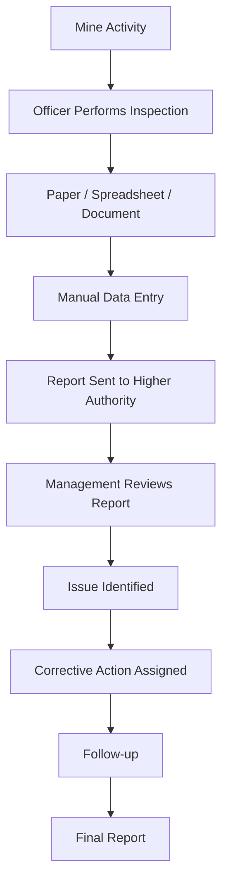

### Problems

This approach can create:

- Delayed reporting
- Duplicate data
- Missing information
- Manual errors
- Difficult tracking
- Poor visibility
- Delayed escalation
- Difficulty identifying recurring issues
- Large amounts of paperwork

---

# 🟢 Our Proposed Solution

We propose a centralized platform where mine activities can be digitally recorded, monitored, analyzed, and acted upon.

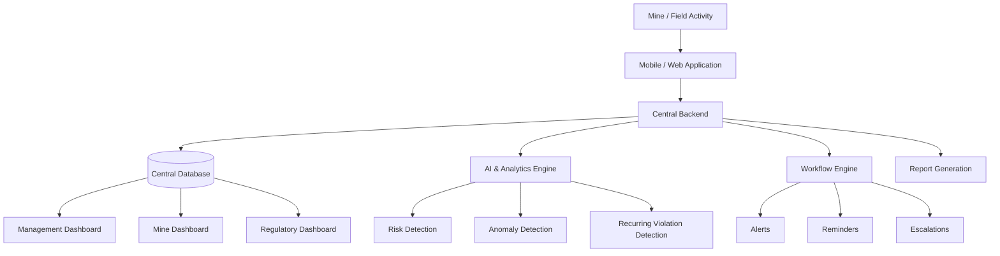

---

# 👨‍💼 Real-World Example

Let's consider a fictional coal mine:

**Mine:** Rajpur Coal Mine  
**Mine Officer:** Rahul  
**Corporate Manager:** Priya

---

## Step 1 — Inspection

Rahul visits a mining area for a safety inspection.

He discovers:

> A safety barricade is damaged near a restricted area.

Instead of writing this on paper, Rahul opens the mobile application.

---

## Step 2 — Field Reporting

Rahul creates a safety observation.

He records:

- Category
- Description
- Photos
- Location
- Date and time
- Severity
- Responsible department

The mobile application automatically records:

```text
GPS Location
Timestamp
Inspector
Mine
```

---

## Step 3 — Backend Processing

The report is sent to the backend.

```text
Mobile App
    ↓
API
    ↓
Authentication
    ↓
Validation
    ↓
Database
```

The issue is stored securely.

---

## Step 4 — AI Analysis

The AI/analytics engine analyzes the observation.

It determines that:

```text
Issue Category: Safety
Severity: High
Risk: High
```

If similar issues have occurred repeatedly in the same area, the system can increase the risk score.

---

## Step 5 — Automatic Escalation

Because the issue is high-risk, the system generates an alert.

```text
High Risk Issue
      ↓
Responsible Officer
      ↓
Mine Manager
      ↓
Corporate Management
```

---

## Step 6 — Corrective Action

The responsible officer receives the task.

They update:

```text
Status:
Open → In Progress
```

After fixing the problem:

```text
In Progress → Resolved
```

Evidence such as a photograph or document can be uploaded.

---

## Step 7 — Verification

The authorized inspector verifies the corrective action.

```text
Resolved
   ↓
Verification
   ↓
Approved
   ↓
Closed
```

---

## Step 8 — Management Dashboard

Management can now see:

```text
Total Issues       : 128
Open Issues        : 24
High Risk Issues   : 7
Overdue Actions    : 5
Resolved           : 99
```

The manager immediately understands the situation without manually checking dozens of spreadsheets.

---

# ⭐ Key Features

## 🔴 Must-Have Features

### 1. Role-Based Authentication

Different users get different permissions.

Example:

```text
Admin
Mine Officer
Inspector
Contractor
Management
Regulatory Authority
```

---

### 2. Centralized Dashboard

A dashboard provides an overview of:

- Compliance status
- Open violations
- Inspections
- Corrective actions
- Risk levels
- Overdue tasks
- Mine performance

---

### 3. Compliance Management

The system maintains compliance requirements.

Each compliance item can have:

```text
Requirement
Category
Due Date
Responsible Person
Status
Documents
Risk Level
```

---

### 4. Inspection Management

Officials can:

- Create inspections
- Assign inspectors
- Record observations
- Upload evidence
- Mark violations
- Create corrective actions
- Track completion

---

### 5. Geo-Tagged Field Reporting

Field users can submit reports containing:

```text
Latitude
Longitude
Timestamp
Photos
Description
Inspector
Mine
```

This helps verify where and when the activity happened.

---

### 6. Corrective Action Tracking

Every issue gets a lifecycle:

```text
Reported
   ↓
Assigned
   ↓
In Progress
   ↓
Resolved
   ↓
Verified
   ↓
Closed
```

---

### 7. Automated Alerts

The system can generate alerts for:

- Upcoming deadlines
- Overdue compliance
- High-risk observations
- Unresolved violations
- Repeated failures

---

### 8. AI-Based Risk Analysis

AI/analytics can help identify:

- High-risk mines
- Recurring violations
- Compliance trends
- Operational anomalies
- Potential future risks

---

### 9. Document Management

Important documents can be uploaded and associated with:

- Compliance requirements
- Inspections
- Corrective actions
- Contractors
- Reports

---

### 10. Reports

The system can generate reports such as:

- Compliance reports
- Inspection reports
- Violation reports
- Corrective action reports
- Mine performance reports

---

# 🟡 Should-Have Features

If sufficient development time is available:

- GIS mine monitoring
- OCR for scanned documents
- Advanced analytics
- Contractor performance scoring
- Notification center
- Email notifications
- Offline mobile support
- Multilingual interface
- Advanced audit logs
- Predictive risk scoring

---

# 🟢 Nice-to-Have Features

These should **not** be prioritized before the core system works.

- Conversational AI assistant
- Advanced predictive models
- Blockchain-based audit trails
- Voice-based reporting
- Advanced computer vision
- IoT sensor integration
- Advanced digital twin
- Complex microservice architecture

---

# 👥 User Roles

| Role | Main Responsibilities |
|---|---|
| **System Admin** | Manage users, mines, permissions and system configuration |
| **Mine Officer** | Monitor mine activities and manage issues |
| **Field Inspector** | Perform inspections and submit observations |
| **Department Officer** | Handle assigned corrective actions |
| **Contractor** | View assigned work and submit compliance information |
| **Corporate Management** | Monitor multiple mines and analyze performance |
| **Regulatory Authority** | View compliance and inspection information |
| **Auditor** | Review historical records and audit trails |

---

# 🔐 Role-Permission Model

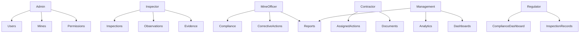

---

# 🔄 Complete System Workflow

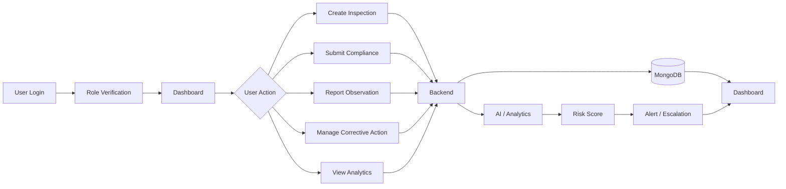

---

# 🕵️ Inspection Workflow

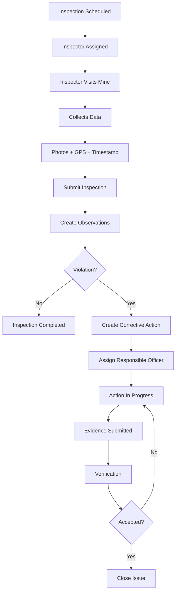

---

# 📋 Compliance Monitoring Workflow

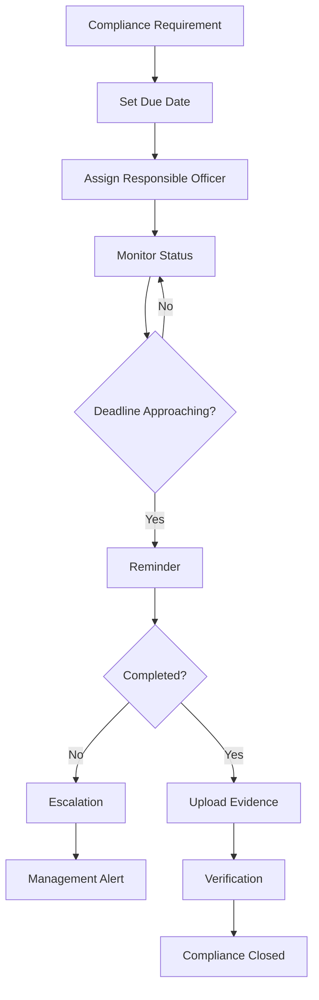

---

# 🤖 AI Risk Detection Workflow

AI should not simply be added because the problem statement contains the word "AI".

It should solve a real problem.

Our AI/analytics engine can analyze historical and current data.

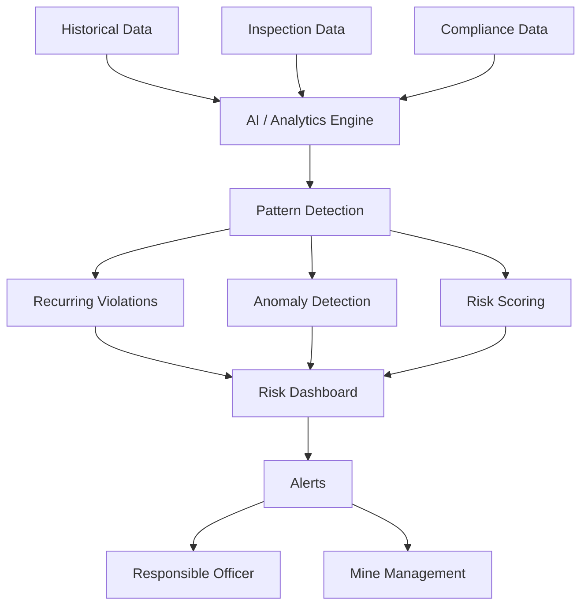

### Example

Suppose a mine has repeatedly reported:

```text
Safety Issue
Safety Issue
Safety Issue
Safety Issue
```

The system can detect the pattern and classify the area as higher risk.

---

# 🗺️ GIS / Location Workflow

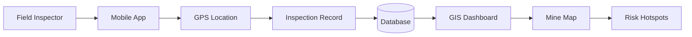

---

# 🏗️ System Architecture

The system follows a **MERN-based centralized architecture**.

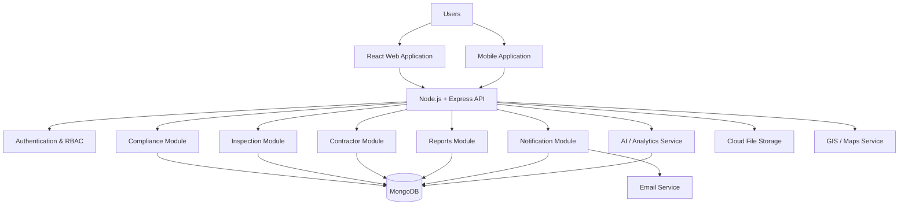

---

# 🧰 Technology Stack

## Frontend

- React.js
- Vite
- Tailwind CSS
- React Router
- Axios
- Zustand
- Recharts
- Leaflet / React Leaflet

### Why?

React is suitable for building dashboards and role-based interfaces while keeping the development process familiar for a MERN team.

---

# ⚙️ Backend

- Node.js
- Express.js
- MongoDB
- Mongoose
- REST APIs
- JWT
- bcrypt

### Why?

The MERN stack allows the team to use JavaScript/TypeScript throughout the application and is practical for rapid SIH development.

---

# 🗄️ Database

### MongoDB

MongoDB is suitable for the prototype because the system contains different types of records:

- Inspections
- Observations
- Documents
- Compliance items
- Corrective actions
- Notifications
- Audit records

The schema can evolve as requirements become clearer.

---

# 🔐 Authentication

Recommended approach:

```text
JWT Authentication
        +
Role-Based Access Control
        +
Password Hashing
        +
Input Validation
```

---

# ☁️ File Storage

Documents and images should not be stored directly inside MongoDB.

Instead:

```text
User
 ↓
Upload File
 ↓
Backend Validation
 ↓
Cloud/Object Storage
 ↓
File URL
 ↓
MongoDB stores Metadata + URL
```

Possible prototype options:

- Cloudinary
- Cloud object storage
- Local storage during development

---

# 🧠 AI / ML

AI should be introduced in a practical way.

### Prototype Approach

Start with:

- Rule-based risk scoring
- Statistical anomaly detection
- Historical trend analysis

Then optionally add:

- ML-based risk prediction
- NLP for document classification
- OCR
- LLM-based document/question answering

This approach avoids building an unnecessarily complicated AI system before the core application works.

---

# 🗃️ Database Architecture

A simplified database structure:

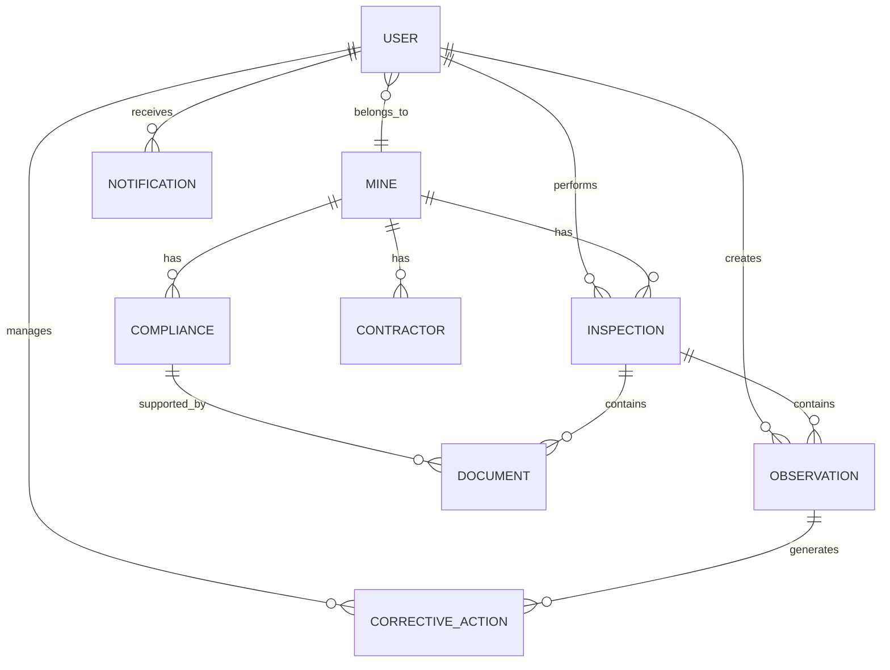

---

# 📦 Core Collections

## Users

Stores:

```text
_id
name
email
passwordHash
role
mineId
department
status
createdAt
updatedAt
```

---

## Mines

Stores:

```text
_id
name
code
location
subsidiary
status
createdAt
updatedAt
```

---

## Inspections

Stores:

```text
_id
mineId
inspectorId
inspectionType
scheduledAt
completedAt
status
location
notes
```

---

## Observations

Stores:

```text
_id
inspectionId
mineId
category
description
severity
location
images
status
createdBy
createdAt
```

---

## Compliance

Stores:

```text
_id
mineId
title
category
description
dueDate
responsibleUser
status
riskLevel
documents
```

---

## Corrective Actions

Stores:

```text
_id
observationId
assignedTo
description
priority
dueDate
status
evidence
verifiedBy
```

---

## Notifications

Stores:

```text
_id
recipient
type
title
message
read
createdAt
```

---

# 🎨 Frontend Pages

## Public

```text
/
├── Landing Page
├── Login
└── Forgot Password
```

---

## Dashboard

```text
/dashboard
```

Displays:

- Compliance percentage
- Open issues
- High-risk issues
- Pending inspections
- Overdue actions
- Mine performance
- Recent activities

---

## Mine Management

```text
/mines
/mines/:id
```

---

## Inspections

```text
/inspections
/inspections/create
/inspections/:id
```

---

## Observations

```text
/observations
/observations/:id
```

---

## Compliance

```text
/compliance
/compliance/:id
```

---

## Corrective Actions

```text
/actions
/actions/:id
```

---

## Analytics

```text
/analytics
```

Displays:

- Trends
- Risk distribution
- Compliance trends
- Violation categories
- Mine comparisons

---

## Reports

```text
/reports
```

---

## Admin

```text
/admin/users
/admin/mines
/admin/settings
/admin/audit-logs
```

---

# 🧭 Navigation Structure

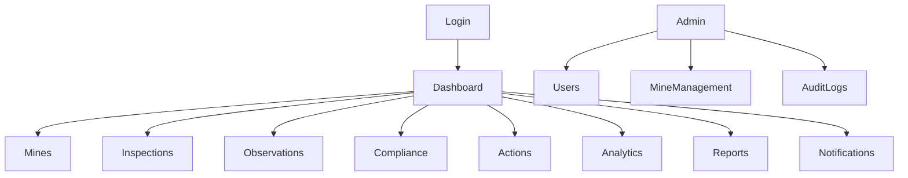

---

# 🧩 Backend Architecture

Recommended request flow:

```text
HTTP Request
     ↓
Express Route
     ↓
Authentication Middleware
     ↓
Authorization / RBAC
     ↓
Validation Middleware
     ↓
Controller
     ↓
Service Layer
     ↓
Mongoose Model
     ↓
MongoDB
     ↓
Service
     ↓
Controller
     ↓
JSON Response
```

---

# 📁 Backend Folder Structure

```text
backend/
│
├── src/
│   ├── config/
│   │   ├── db.js
│   │   └── env.js
│   │
│   ├── controllers/
│   │   ├── auth.controller.js
│   │   ├── user.controller.js
│   │   ├── mine.controller.js
│   │   ├── inspection.controller.js
│   │   ├── compliance.controller.js
│   │   ├── observation.controller.js
│   │   └── report.controller.js
│   │
│   ├── models/
│   │   ├── User.js
│   │   ├── Mine.js
│   │   ├── Inspection.js
│   │   ├── Observation.js
│   │   ├── Compliance.js
│   │   ├── CorrectiveAction.js
│   │   └── Notification.js
│   │
│   ├── routes/
│   ├── services/
│   ├── middleware/
│   ├── utils/
│   ├── validators/
│   ├── app.js
│   └── server.js
│
├── tests/
├── .env
├── .gitignore
└── package.json
```

---

# 📁 Frontend Folder Structure

```text
frontend/
│
├── src/
│   ├── components/
│   ├── pages/
│   ├── layouts/
│   ├── hooks/
│   ├── services/
│   ├── store/
│   ├── utils/
│   ├── types/
│   ├── assets/
│   ├── routes/
│   ├── App.jsx
│   └── main.jsx
│
├── public/
├── .env
├── .gitignore
└── package.json
```

---

# 🔌 API Architecture

The backend will expose REST APIs.

## Authentication

```text
POST /api/auth/register
POST /api/auth/login
POST /api/auth/logout
GET  /api/auth/me
```

---

## Users

```text
GET    /api/users
GET    /api/users/:id
POST   /api/users
PATCH  /api/users/:id
DELETE /api/users/:id
```

---

## Mines

```text
GET    /api/mines
GET    /api/mines/:id
POST   /api/mines
PATCH  /api/mines/:id
```

---

## Inspections

```text
GET  /api/inspections
GET  /api/inspections/:id
POST /api/inspections
PATCH /api/inspections/:id
```

---

## Observations

```text
GET   /api/observations
GET   /api/observations/:id
POST  /api/observations
PATCH /api/observations/:id
```

---

## Compliance

```text
GET   /api/compliance
GET   /api/compliance/:id
POST  /api/compliance
PATCH /api/compliance/:id
```

---

## Corrective Actions

```text
GET   /api/actions
GET   /api/actions/:id
POST  /api/actions
PATCH /api/actions/:id
```

---

## Reports

```text
GET /api/reports/compliance
GET /api/reports/inspections
GET /api/reports/violations
GET /api/reports/risk
```

---

# 🔒 Security

Because this system deals with governance and compliance data, security is important.

We will implement:

### Authentication

- Secure password hashing
- JWT-based authentication
- Token expiration
- Secure authentication flow

### Authorization

RBAC ensures that users cannot access functionality outside their role.

### Validation

Use request validation before processing data.

### Injection Protection

Use Mongoose safely and validate user input.

### File Upload Security

Validate:

- File type
- File size
- File extension
- MIME type

Do not blindly accept uploaded files.

### API Security

Implement:

- Rate limiting
- CORS configuration
- Security headers
- Input sanitization
- Proper error handling

### Secrets

Never commit:

```text
.env
API Keys
JWT Secrets
Database Credentials
Cloud Credentials
```

Use environment variables.

---

# 🛣️ Development Roadmap

## Phase 0 — Understanding & Planning

### Tasks

- Understand SIH problem
- Define users
- Define features
- Finalize architecture
- Design database

### Output

Complete project blueprint.

---

## Phase 1 — Project Setup

### Tasks

- Create GitHub repository
- Initialize frontend
- Initialize backend
- Configure environment variables
- Setup Git workflow

### Output

Running frontend + backend.

---

## Phase 2 — Database

### Tasks

- Create MongoDB database
- Create Mongoose models
- Add indexes
- Seed demo data

### Output

Working database.

---

## Phase 3 — Backend Foundation

### Tasks

- Express setup
- Error handling
- Middleware
- API structure
- Validation

### Output

Stable backend foundation.

---

## Phase 4 — Authentication

### Tasks

- Register
- Login
- Password hashing
- JWT
- RBAC

### Output

Secure login system.

---

## Phase 5 — Core Features

Build in this order:

```text
Mines
  ↓
Compliance
  ↓
Inspections
  ↓
Observations
  ↓
Corrective Actions
  ↓
Notifications
  ↓
Reports
```

---

## Phase 6 — Frontend

Build:

```text
Authentication
↓
Dashboard
↓
Mines
↓
Inspections
↓
Compliance
↓
Observations
↓
Actions
↓
Analytics
↓
Reports
```

---

## Phase 7 — Integration

Connect:

```text
React
   ↓
REST APIs
   ↓
Express
   ↓
MongoDB
```

---

## Phase 8 — Testing

Test:

- Authentication
- Permissions
- APIs
- Forms
- File uploads
- Workflows
- Error states

---

## Phase 9 — Security

Review:

- Authentication
- RBAC
- API security
- File security
- Secrets
- Rate limiting
- Input validation

---

## Phase 10 — Deployment

Deploy:

```text
Frontend
   ↓
Cloud Hosting

Backend
   ↓
Cloud Server

Database
   ↓
MongoDB Atlas

Files
   ↓
Cloud Storage
```

---

## Phase 11 — Demo Preparation

Prepare:

- Demo account
- Demo data
- Demo workflow
- Backup environment
- Presentation
- Architecture diagram
- Impact metrics

---

# 🚀 MVP vs Final SIH Version

## MVP

The MVP should focus on the **core problem**.

### Build:

- Authentication
- RBAC
- Mine management
- Compliance tracking
- Inspection management
- Observation reporting
- Corrective actions
- Dashboard
- Basic notifications
- Basic reports
- Basic risk scoring

### Do NOT build initially:

- Blockchain
- Complex ML
- IoT integration
- Advanced computer vision
- Voice assistant
- Microservices
- Complex Kubernetes infrastructure

---

# 🏆 Final SIH Version

After the MVP works:

- AI risk prediction
- GIS visualization
- OCR
- Advanced analytics
- Offline mobile application
- Multilingual support
- Contractor scoring
- Advanced audit trail
- Automated report generation
- Predictive alerts

The philosophy is:

```text
Working Core
     ↓
Reliable System
     ↓
Good UX
     ↓
AI
     ↓
Advanced Features
```

Not:

```text
100 Features
     ↓
Nothing Works Properly
```

---

# 🧪 Testing Strategy

## Unit Testing

Test individual functions.

Example:

```text
calculateRiskScore()
validateCompliance()
checkPermission()
```

---

## API Testing

Test:

```text
Login
Create Inspection
Create Observation
Update Corrective Action
Get Dashboard
```

---

## Integration Testing

Verify:

```text
API → Service → Database
```

---

## End-to-End Testing

Example:

```text
Login
 ↓
Create Inspection
 ↓
Create Observation
 ↓
Assign Corrective Action
 ↓
Resolve
 ↓
Verify
 ↓
Close
```

---

# ☁️ Deployment Architecture

A simple production architecture:

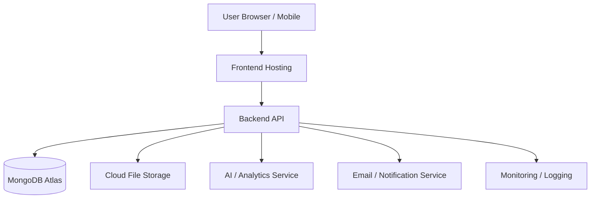

For a student prototype, keep the deployment simple.

Possible architecture:

```text
React/Vite
    ↓
Frontend Hosting

Node/Express
    ↓
Backend Hosting

MongoDB Atlas
    ↓
Database

Cloudinary / Object Storage
    ↓
Documents & Images
```

---

# 💰 Cost Strategy

For the prototype, prefer free tiers wherever practical.

Potential free/low-cost components:

| Component | Prototype Option |
|---|---|
| Frontend | Free hosting |
| Backend | Free/low-cost cloud hosting |
| Database | MongoDB Atlas free tier |
| Images | Cloudinary/free object storage tier |
| Maps | OpenStreetMap + Leaflet |
| Git | GitHub |
| CI/CD | GitHub Actions |
| Email | Free-tier email service |
| AI | Limited API/free model where available |

Always verify current limits before deployment because free-tier policies can change.

---

# 🎬 SIH Demo Strategy

The demo should tell a story rather than showing random features.

## Recommended Demo

### Step 1 — Show the Problem

Explain:

> Coal mines generate a large amount of compliance, inspection, operational and field-level information. Fragmented reporting makes monitoring and decision-making difficult.

---

### Step 2 — Login as Mine Officer

Show the dashboard.

Display:

```text
Compliance       87%
Open Issues       24
High Risk          7
Overdue Actions    5
```

---

### Step 3 — Create Field Inspection

Create an inspection.

Add:

- Location
- Observation
- Photo
- Severity

---

### Step 4 — AI Risk Analysis

Show:

```text
Risk Level: HIGH
Reason:
• Similar violation occurred 4 times
• Corrective action overdue
• Safety category
```

---

### Step 5 — Automatic Escalation

Show the notification:

```text
HIGH-RISK SAFETY ISSUE

Escalated to:
Mine Manager
Corporate Management
```

---

### Step 6 — Corrective Action

Change:

```text
Open
 ↓
In Progress
 ↓
Resolved
 ↓
Verified
 ↓
Closed
```

---

### Step 7 — Management Dashboard

Show the management dashboard.

Demonstrate:

- Multiple mines
- Risk comparison
- Compliance trends
- Open issues
- Overdue actions

---

### Step 8 — Final Impact

End with:

```text
Before

Manual
Fragmented
Delayed
Reactive


After

Centralized
Automated
Real-Time
Data-Driven
```

---

# 📊 Demo Data

Do not depend on live government data during the SIH presentation.

Use realistic **synthetic/demo data**.

Example:

```text
Mine: Rajpur Coal Mine

Total Compliance Items: 150
Compliant: 130
Pending: 13
Overdue: 7

Inspections: 42

Open Observations: 24

High Risk: 7

Corrective Actions:
Completed: 86
Pending: 12
Overdue: 5
```

---

# 🛡️ Demo Failure Protection

The demo should continue even if an external API fails.

Use:

```text
Live API
   ↓
If Available
   ↓
Use Live Data

If Unavailable
   ↓
Fallback Mock Data
```

Do not make the entire demo dependent on:

- AI API
- Maps API
- Email API
- Internet connectivity

The core workflow should work locally or from the deployed backend.

---

# ⚠️ Edge Cases

The system must handle:

### Invalid Input

```text
Invalid data
 ↓
Validation error
 ↓
User fixes input
```

### Duplicate Data

Detect possible duplicate submissions.

### Unauthorized Access

```text
Unauthorized
 ↓
403 Forbidden
```

### Large Files

Reject files exceeding configured limits.

### Wrong File Type

Only allow approved file types.

### Database Failure

Return a safe error without exposing internal details.

### API Failure

Provide fallback behavior wherever possible.

### No Internet

For mobile field reporting, future versions can support offline storage and synchronization.

---

# 📈 Scalability

The prototype should remain simple.

If the system grows to thousands of users and mines:

### Database

Use:

- Indexes
- Pagination
- Query optimization
- Proper schema design

### Caching

Introduce Redis only when necessary.

### Background Jobs

Use queues for:

- Report generation
- Notifications
- AI processing
- OCR

### File Storage

Move large files to object storage.

### API Scaling

Use:

```text
Load Balancer
      ↓
Backend Instance 1
Backend Instance 2
Backend Instance 3
```

### Monitoring

Track:

- API errors
- Response times
- Database performance
- Server health
- Failed jobs

---

# 👨‍💻 Team Development Strategy

For a team of students, divide work into independent modules.

Example:

| Member | Responsibility |
|---|---|
| Member 1 | Frontend + UI/UX |
| Member 2 | Backend + Authentication |
| Member 3 | Database + Core APIs |
| Member 4 | AI/Analytics + GIS |
| Member 5 | Testing + DevOps + Integration |

All members should work against agreed API contracts.

---

# 🌿 Git Workflow

Recommended branch structure:

```text
main
 │
 ├── develop
 │
 ├── feature/auth
 ├── feature/compliance
 ├── feature/inspection
 ├── feature/dashboard
 ├── feature/ai-risk
 └── feature/deployment
```

Workflow:

```text
Create Branch
     ↓
Develop
     ↓
Commit
     ↓
Push
     ↓
Pull Request
     ↓
Code Review
     ↓
Merge into develop
     ↓
Test
     ↓
Merge into main
```

Never directly push experimental code to `main`.

---

# 📌 Project Priorities

Our development priority is:

```text
1. Understand the problem
          ↓
2. Build the core workflow
          ↓
3. Make it reliable
          ↓
4. Add good UI/UX
          ↓
5. Add analytics
          ↓
6. Add meaningful AI
          ↓
7. Deploy
          ↓
8. Prepare SIH demo
```

---

# 🚫 What We Should NOT Do Initially

Avoid spending early development time on:

- Blockchain
- Microservices
- Kubernetes
- Complex DevOps
- Advanced computer vision
- Custom LLM training
- IoT hardware
- Excessive animations
- Dozens of unnecessary dashboards

These can make the project appear complicated while reducing reliability.

---

# 🎯 Final Product Vision

The final system should become a centralized governance platform connecting:

```text
                 COAL MINES
                     │
        ┌────────────┼────────────┐
        ↓            ↓            ↓
   Compliance   Inspections   Contractors
        │            │            │
        └────────────┼────────────┘
                     ↓
            CENTRAL PLATFORM
                     │
          ┌──────────┼──────────┐
          ↓          ↓          ↓
        AI        Analytics   Workflows
          │          │          │
          └──────────┼──────────┘
                     ↓
              DECISION SUPPORT
                     │
       ┌─────────────┼─────────────┐
       ↓             ↓             ↓
     Mine         Corporate      Regulatory
   Officials      Management     Authorities
```

---

# 🌟 Expected Impact

The platform aims to help coal mining governance become:

### More Transparent

Centralized records and audit trails improve visibility.

### More Accountable

Every action can be associated with responsible users and deadlines.

### Faster

Automated workflows reduce manual reporting delays.

### More Proactive

Risk analytics can highlight issues before they become larger problems.

### More Data-Driven

Management gets dashboards and analytics instead of relying entirely on manually prepared reports.

### More Scalable

The architecture can be extended from a prototype to multiple mines and subsidiaries.

---

# 🔮 Future Scope

Potential future extensions include:

- AI-powered compliance assistant
- Natural-language querying
- OCR document processing
- Predictive safety risk models
- Computer vision for safety observations
- IoT sensor integration
- Offline-first mobile applications
- Multilingual support
- Voice-based reporting
- Advanced GIS heatmaps
- Automated regulatory report generation
- Cross-mine benchmarking
- Enterprise-level integrations

---

# 🚀 Getting Started

> Development instructions will be added as the project is implemented.

Basic development workflow:

```bash
# Clone repository
git clone <repository-url>

# Enter project
cd <project-directory>

# Install dependencies
npm install

# Start development server
npm run dev
```

Backend and frontend setup instructions will be documented separately as development progresses.

---

# 📂 Repository Structure

The final repository is expected to follow a structure similar to:

```text
coal-mine-governance/
│
├── frontend/
│
├── backend/
│
├── docs/
│   ├── architecture/
│   ├── api/
│   ├── database/
│   └── demo/
│
├── README.md
├── .gitignore
└── LICENSE
```

---

# 📚 Documentation

Project documentation should eventually contain:

```text
docs/
├── architecture/
├── database/
├── api/
├── user-flows/
├── security/
├── deployment/
└── demo/
```

---

# 👥 Team

### Smart India Hackathon 2026

**Problem Statement:** SIH26024  
**Organization:** Ministry of Coal  
**Department:** Coal India Limited  
**Theme:** Smart Automation

### Development Team

| Name | Role |
|---|---|
| Keshav Saini | Full-Stack / MERN Developer |
| Team Member | — |
| Team Member | — |
| Team Member | — |
| Team Member | — |

---

# 📜 Disclaimer

This project is a **Smart India Hackathon prototype/concept implementation**.

Any mine names, operational records, compliance data, inspection records, users, contractors, locations, and statistics used in the prototype are **synthetic/demo data unless explicitly identified otherwise**.

The system architecture and workflows are designed based on the SIH problem statement and publicly understandable governance requirements. Actual deployment in a government or coal-mining environment would require validation against applicable laws, regulations, organizational processes, cybersecurity requirements, infrastructure standards, and official APIs/data sources.

---

# ⭐ Project Philosophy

> **Build the solution first. Add intelligence second.**

```text
Simple
  ↓
Working
  ↓
Reliable
  ↓
Secure
  ↓
Scalable
  ↓
Intelligent
```

The goal is not to build the largest system.

The goal is to build a system that **clearly solves the problem, works during the demo, can be explained easily, and has a realistic path toward production deployment.**

---

## 🚀 Development Status

```text
[ ] Problem Understanding
[ ] Product Planning
[ ] Architecture
[ ] Database Design
[ ] Backend Setup
[ ] Authentication
[ ] Compliance Module
[ ] Inspection Module
[ ] Corrective Action Module
[ ] Dashboard
[ ] AI / Risk Engine
[ ] GIS
[ ] Reports
[ ] Testing
[ ] Deployment
[ ] SIH Demo Preparation
```

---

## 🏆 Smart India Hackathon 2026

**SIH26024 — AI-Based Smart Governance and Compliance Monitoring System for Coal Mines**

**Centralized Governance • Compliance Monitoring • Field Intelligence • AI-Assisted Decision Making**
