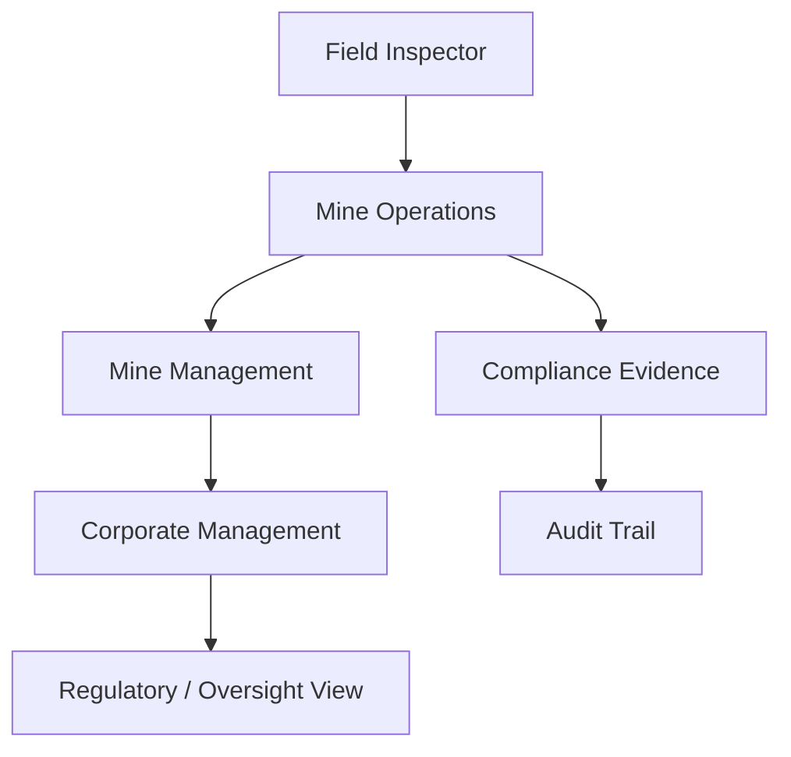
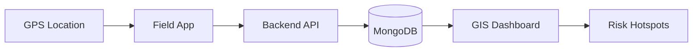
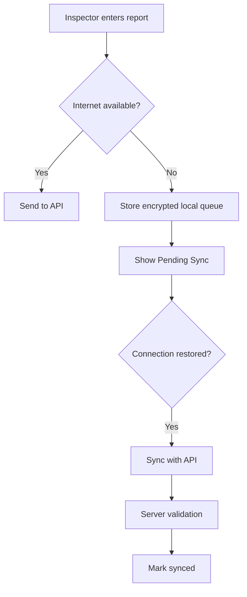
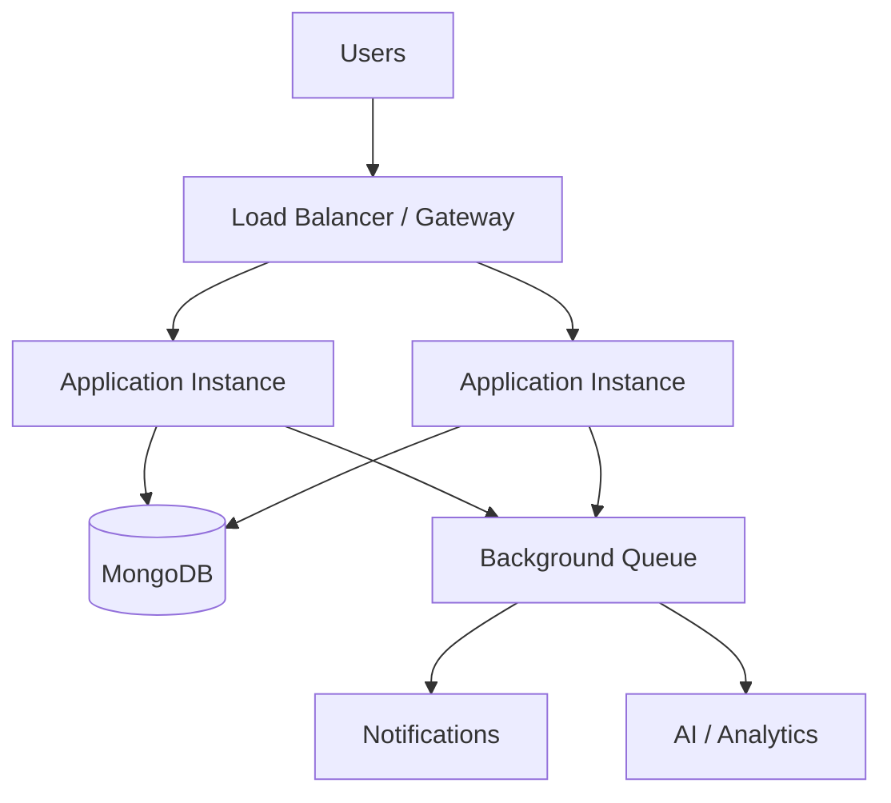

# Feasibility & Viability

## 1. Executive Summary

The proposed **AI-Based Smart Governance & Compliance Monitoring System for Coal Mines** is technically feasible as a web-first MERN platform with a mobile field-reporting layer.

The solution does not require all advanced technologies to be implemented on day one. A realistic implementation path is:

1. Centralized digital records
2. Role-based workflows
3. Compliance and inspection tracking
4. Geo-tagged field reporting
5. Dashboards and automated alerts
6. Rule-based risk scoring and analytics
7. OCR/ML/AI enhancements where data quality justifies them

This staged approach makes the project suitable for an SIH prototype while preserving a credible path toward production deployment.

---

## 2. Technical Feasibility

| Area | Feasibility | Approach |
|---|---|---|
| Web application | High | React + Vite |
| Backend APIs | High | Node.js + Express |
| Database | High | MongoDB + Mongoose |
| Authentication | High | JWT + secure password hashing + RBAC |
| Compliance workflows | High | REST APIs + scheduled jobs |
| Inspection management | High | Digital forms + evidence + workflow |
| GIS | High | Leaflet + OpenStreetMap-compatible provider |
| Mobile field reporting | High | React Native/Expo |
| Offline support | Medium-High | Local queue + sync mechanism |
| Notifications | High | Email/in-app; SMS/WhatsApp can be added later |
| OCR | Medium-High | External OCR service or Python service |
| AI risk scoring | High for MVP | Explainable rules/statistics |
| Predictive ML | Medium | Requires historical labeled data |
| Blockchain audit trail | Technically possible | Not required for MVP |
| Large-scale deployment | High | Cloud infrastructure + indexes + queues + caching |

---

## 3. Operational Feasibility

The platform fits existing governance activities because it digitizes rather than completely redesigning them.

### Existing activity → Digital equivalent

- Paper/spreadsheet compliance register → centralized compliance register
- Manual inspection reports → structured inspection workflow
- Phone-based escalation → automated notifications and escalation
- Scattered photographs → evidence attached to observations
- Delayed management reporting → live dashboards
- Manual location description → GPS coordinates + map
- Repeated manual report preparation → generated reports

The system should support existing organizational approval chains instead of assuming that every mine follows an identical process.

---

## 4. Economic Feasibility

The SIH prototype can be built using mostly open-source software and free/developer tiers.

### Prototype cost strategy

- React / Node.js / Express / MongoDB: open-source
- Leaflet: open-source
- OpenStreetMap data: usable subject to provider policies and attribution
- Cloud hosting: free/developer tiers where suitable
- Object storage: developer/free tier initially
- Email: development sandbox/free tier
- AI: rule-based engine initially, avoiding unnecessary API costs

Production costs will depend on number of mines, users, storage, notification volume, uptime requirements, security controls, support and integration requirements.

**Conclusion:** the prototype is economically feasible; production cost must be calculated from actual deployment scale.

---

## 5. Organizational Feasibility

The platform can serve multiple stakeholder levels:



Different roles see different data and actions through RBAC.

---

## 6. AI Feasibility

AI should be introduced progressively.

### Phase 1 — Explainable risk engine

Example:

```text
Risk Score =
  Severity Weight
+ Recurrence Weight
+ Overdue Weight
+ Compliance Criticality
+ Escalation Weight
```

The result can classify an item as:

- Low
- Medium
- High
- Critical

### Phase 2 — Statistical anomaly detection

Detect unusual changes in:

- inspection frequency
- overdue compliance
- recurring observations
- incident frequency
- production-related operational metrics

### Phase 3 — ML prediction

After enough historical data exists, supervised/unsupervised models can estimate:

- probability of repeated violations
- high-risk mine/area
- likely overdue corrective actions
- abnormal operational patterns

The AI should remain a **decision-support system**, not an autonomous authority.

---

## 7. GIS Feasibility

GIS is highly feasible because the core requirement is visualization of mine sites, inspections and observations.



The prototype can use Leaflet with a suitable tile/geocoding provider. Production deployments should use an infrastructure and usage policy appropriate for organizational scale.

---

## 8. Offline Feasibility

Offline support is important for field environments where connectivity may be unreliable.

Recommended design:



Conflict handling should use unique client IDs and server timestamps rather than blindly overwriting records.

---

## 9. Security Feasibility

Security is feasible using standard web security practices:

- HTTPS
- JWT expiration
- secure password hashing
- RBAC
- request validation
- rate limiting
- secure headers
- CORS configuration
- file type/size validation
- audit logging
- secret management
- database access controls
- least-privilege permissions

Production deployment should additionally undergo security testing and organizational review.

---

## 10. Scalability Feasibility

The initial modular monolith is preferable to microservices.



Scale only the components that become bottlenecks.

---

## 11. Key Risks and Mitigation

| Risk | Impact | Mitigation |
|---|---|---|
| Poor data quality | High | Validation + mandatory fields + audit trail |
| Internet unavailable | High | Offline queue |
| AI false positives | Medium | Explainable scoring + human verification |
| Wrong permissions | High | Centralized RBAC middleware |
| Large evidence files | Medium | Object storage + size limits |
| Duplicate reports | Medium | Client IDs + deduplication |
| Regulation changes | High | Versioned compliance requirements |
| Provider/API outage | Medium | Graceful fallback + retry |
| Scope becoming too large | High | MVP-first roadmap |

---

## 12. Overall Verdict

**Technical feasibility: High**

**Operational feasibility: High**

**Prototype economic feasibility: High**

**AI feasibility: High for explainable analytics; Medium for predictive ML**

**Production viability: High, subject to official process, regulatory, security, infrastructure and integration validation**

The strongest SIH strategy is therefore to demonstrate a complete core workflow rather than attempting every advanced technology simultaneously.
