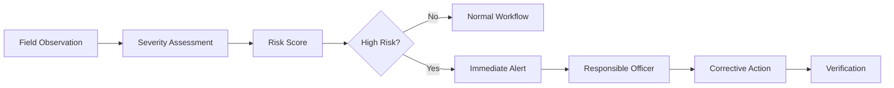
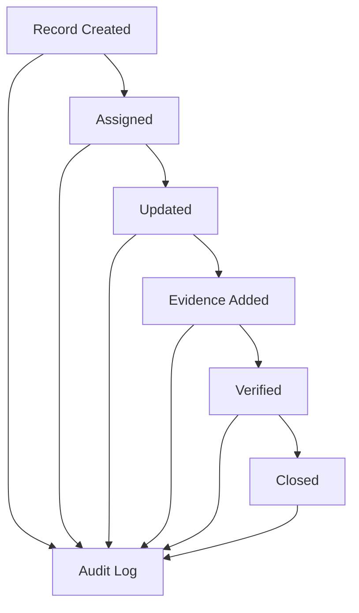
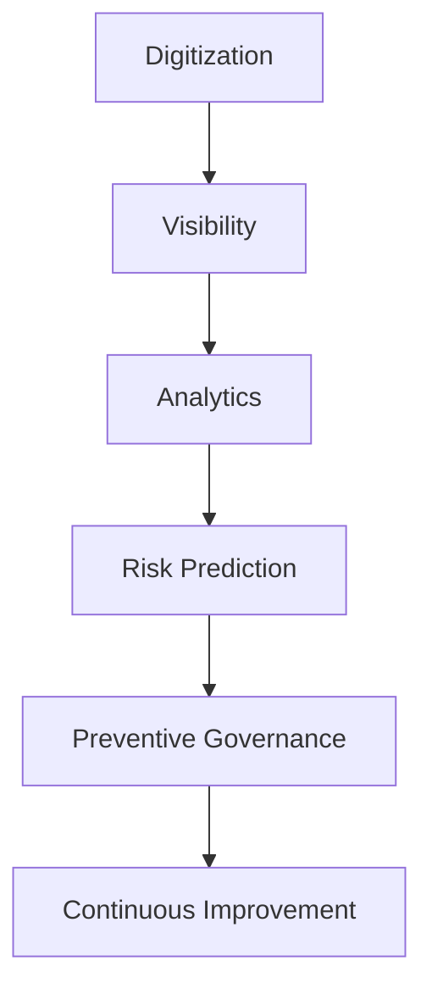

# Impact & Benefits

## 1. Executive Summary

The system is designed to move coal-mine governance from fragmented, delayed and manually coordinated processes toward a centralized, traceable and data-driven operating model.

The primary impact is not simply "using AI". The real impact comes from combining:

**Digital Records + Workflow + Field Evidence + GIS + Analytics + Alerts + Accountability**

---

## 2. Problem-to-Impact Mapping

| Existing Challenge | Proposed Capability | Expected Benefit |
|---|---|---|
| Fragmented records | Centralized platform | Single source of truth |
| Manual compliance tracking | Digital compliance register | Better visibility |
| Delayed escalation | Automated reminders/escalations | Faster action |
| Scattered inspection evidence | Structured evidence management | Better traceability |
| Difficult field monitoring | Geo-tagged mobile reporting | Stronger field visibility |
| Repeated violations | Recurrence analytics | Preventive action |
| Management depends on reports | Live dashboards | Faster decisions |
| Paper-heavy processes | Digital workflows | Lower administrative effort |
| Weak accountability | Role + audit trail | Clear ownership |
| Poor connectivity | Offline-first field reporting | Better field usability |

---

## 3. Stakeholder Benefits

### Field Inspectors

- Faster digital reporting
- GPS and timestamp captured with reports
- Photo/evidence attachment
- Reduced paperwork
- Visibility into assigned corrective actions

### Mine Officers

- Centralized compliance status
- Inspection scheduling
- Observation tracking
- Corrective-action monitoring
- Escalation visibility

### Corporate Management

- Cross-mine comparison
- High-risk mine identification
- Compliance trends
- Recurring failure analysis
- Executive dashboards

### Regulatory / Oversight Authorities

- Structured records
- Evidence-backed observations
- Better visibility into corrective actions
- Auditable history
- Faster access to reports

### Contractors

- Assigned obligations
- Digital submission of evidence
- Action status visibility
- Reduced ambiguity around responsibilities

---

## 4. Safety Impact

The system can help identify and prioritize safety-related issues earlier.



The platform does not replace professional safety judgment. It improves visibility and prioritization.

---

## 5. Compliance Impact

A compliance item can move through a controlled lifecycle:

```text
Requirement
    ↓
Due Date
    ↓
Responsible Person
    ↓
Evidence Submission
    ↓
Verification
    ↓
Compliant / Non-Compliant
    ↓
Corrective Action if required
    ↓
Closure
```

This creates accountability around who owns an item and what evidence supports its status.

---

## 6. Transparency and Accountability

Every important action can be associated with:

- user
- role
- timestamp
- mine
- record
- previous status
- new status
- evidence
- comments

This enables a chronological audit trail.



---

## 7. Environmental Governance Benefits

The platform can support structured tracking of environment-related observations and compliance evidence.

Potential data categories include:

- environmental observations
- monitoring records
- corrective actions
- document evidence
- due dates
- inspection findings

The actual statutory requirements should be configured from authoritative rules and organizational processes rather than hard-coded assumptions.

---

## 8. Operational Benefits

Dashboards can answer questions such as:

- Which mines have the most overdue compliance items?
- Which observations are repeatedly occurring?
- Which corrective actions are overdue?
- Which locations have high-risk observations?
- Which departments have unresolved actions?
- How is compliance trending over time?

This changes management from **report collection** to **exception-based decision-making**.

---

## 9. Quantifiable KPIs

The deployed system can measure:

### Compliance KPIs

- Compliance rate
- Overdue rate
- Average time to closure
- Evidence submission rate
- Repeat violation rate

### Inspection KPIs

- Inspections completed
- Inspections overdue
- Observations per inspection
- High-risk observations
- Average verification time

### Corrective Action KPIs

- Open actions
- Overdue actions
- Average resolution time
- Reopened actions
- Closure verification rate

### Platform KPIs

- Active users
- Reports submitted
- Offline reports synchronized
- Notification delivery rate
- System uptime

---

## 10. Long-Term Impact

With sufficient data and organizational adoption, the platform could evolve toward:



The long-term objective is to make compliance and safety management increasingly proactive rather than reactive.

---

## 11. Important Limitation

The project should not claim that software alone will prevent mining accidents or guarantee statutory compliance.

A more defensible claim is:

> The platform improves the ability to record, monitor, prioritize, escalate, verify and audit governance activities, enabling responsible personnel to make faster and better-informed decisions.

---

## 12. Expected SIH Demonstration Impact

For the hackathon demo, show one issue moving through the complete lifecycle:

**Field Report → GPS Evidence → Risk Detection → Alert → Corrective Action → Resolution → Verification → Dashboard Update**

This single flow demonstrates the practical value of the platform better than isolated AI features.
