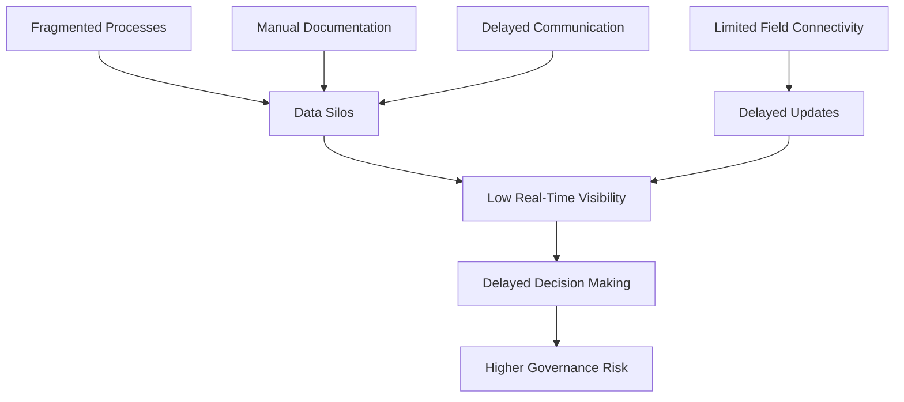
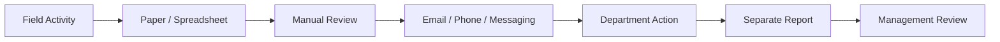
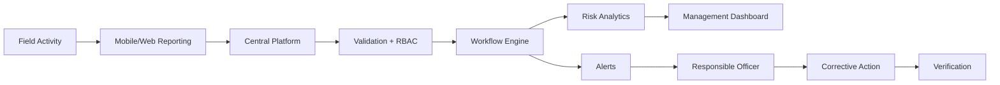

# Problem Definition

## 1. Problem Statement

Coal mining operations involve multiple mines, departments, contractors, field personnel, corporate teams and regulatory stakeholders.

Governance activities such as safety compliance, inspections, environmental monitoring, production-related reporting, labour-related records, contractor obligations and corrective actions can involve different systems, documents, spreadsheets and communication channels.

The result can be fragmented information, delayed reporting, inconsistent records, weak visibility and difficulty identifying recurring or high-risk issues.

The proposed project addresses this gap through a centralized AI-enabled governance and compliance monitoring platform.

---

## 2. Problem in Simple Words

Imagine a mine has 100 compliance requirements and many inspection observations.

Some information may exist in:

- spreadsheets
- paper documents
- emails
- photographs
- individual computers
- messaging applications
- separate reporting systems

A manager may therefore need to collect information from several places before answering a simple question:

> "Which important compliance items are overdue, who owns them, what evidence exists, and which problems are repeatedly happening?"

The problem is not merely lack of data.

**The problem is lack of connected, timely and actionable information.**

---

## 3. Core Problems

### 3.1 Fragmented Information

Different activities may be recorded separately.

This makes cross-module analysis difficult.

### 3.2 Manual Compliance Tracking

Due dates and evidence can be difficult to monitor when managed through spreadsheets or manual reminders.

### 3.3 Delayed Escalation

A serious observation may remain dependent on manual communication before reaching the right decision-maker.

### 3.4 Weak Field Visibility

Management may not have immediate access to where an observation occurred, when it occurred and what evidence was captured.

### 3.5 Repeated Violations

Without historical analytics, recurring issues may be treated as isolated incidents.

### 3.6 Limited Management Visibility

Senior management needs summarized information rather than hundreds of individual reports.

### 3.7 Accountability Gaps

When responsibilities are communicated through informal channels, ownership and closure history can become difficult to audit.

### 3.8 Connectivity Constraints

Field personnel may operate in areas with intermittent network connectivity.

---

## 4. Root Cause Model

---

## 5. Current-State Workflow

This workflow may work at small scale but becomes increasingly difficult to coordinate across many mines and stakeholders.

---

## 6. Desired-State Workflow

---

## 7. Example Scenario

### Situation

A field inspector identifies a damaged safety barricade in a restricted area.

### Without the proposed platform

1. Inspector records the issue manually.
2. Photograph may be stored separately.
3. Location may be described approximately.
4. Responsible department is informed manually.
5. Follow-up depends on communication.
6. Management may see the issue only in a later report.
7. Historical recurrence may not be obvious.

### With the proposed platform

1. Inspector submits the issue digitally.
2. GPS and timestamp are captured.
3. Photograph is attached as evidence.
4. Severity and category are recorded.
5. Backend creates an observation.
6. Risk engine calculates priority.
7. Responsible officer receives an alert.
8. Corrective action is assigned.
9. Resolution evidence is uploaded.
10. Authorized person verifies closure.
11. Dashboard and audit history update automatically.

---

## 8. Who Is Affected?

| Stakeholder | Problem |
|---|---|
| Field Inspector | Manual reporting and weak follow-up |
| Mine Officer | Many scattered tasks and compliance items |
| Department Head | Difficult prioritization |
| Corporate Management | Delayed cross-mine visibility |
| Contractor | Unclear action ownership |
| Auditor | Difficult historical reconstruction |
| Regulatory/Oversight Stakeholder | Need structured and reliable information |

---

## 9. Problem Scope

The project focuses on governance and compliance coordination, especially:

- statutory compliance tracking
- inspections
- observations
- violations
- corrective actions
- contractor obligations
- field reporting
- GIS visualization
- dashboards
- alerts
- reports
- risk analytics

It does **not** attempt to control physical mining machinery or replace specialized mine-safety systems.

---

## 10. Success Criteria

The problem can be considered meaningfully addressed if the system can demonstrate:

- centralized records
- role-based access
- complete inspection workflow
- compliance due-date tracking
- corrective-action lifecycle
- geo-tagged field reports
- evidence management
- automated alerts
- explainable risk scoring
- management dashboards
- searchable audit history

---

## 11. One-Line Problem Definition

> **How can fragmented coal-mine governance and compliance activities be transformed into a centralized, traceable, geo-aware and intelligent workflow that helps responsible stakeholders identify risk earlier and close corrective actions faster?**
