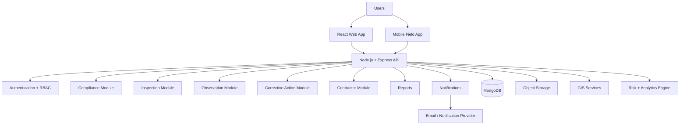
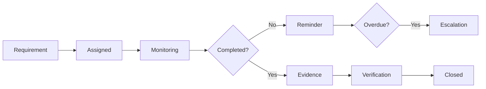
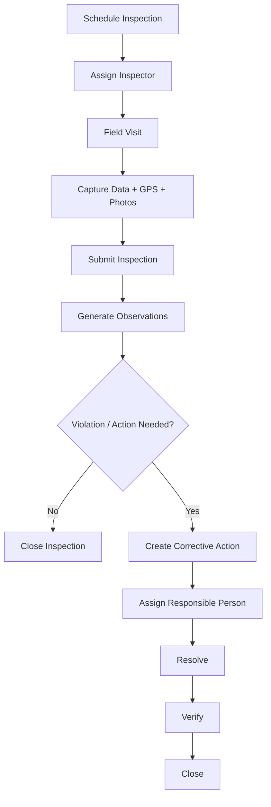
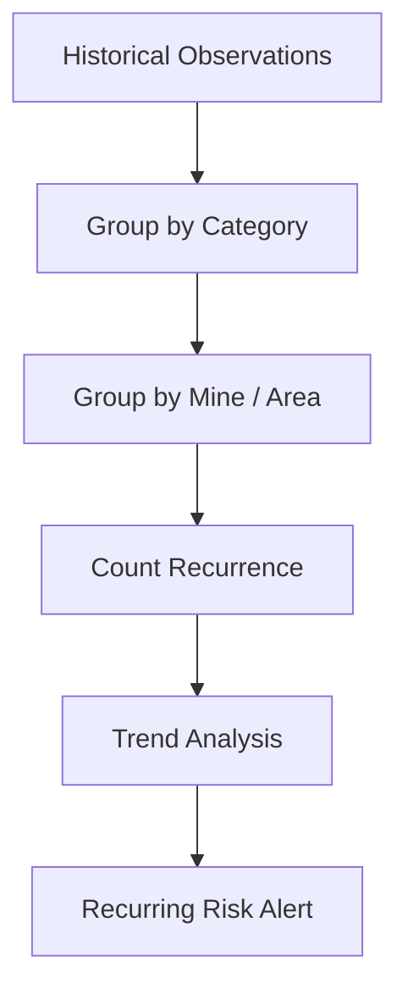
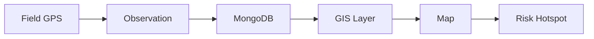
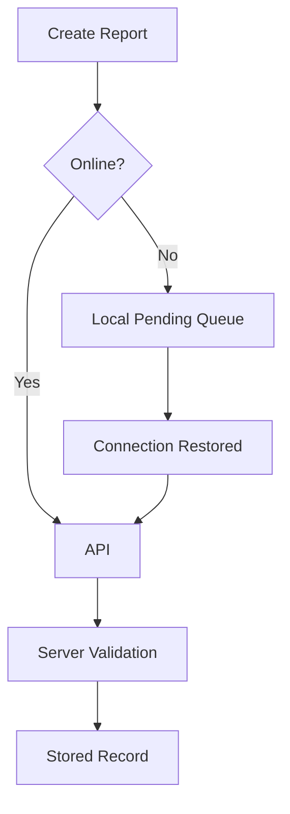
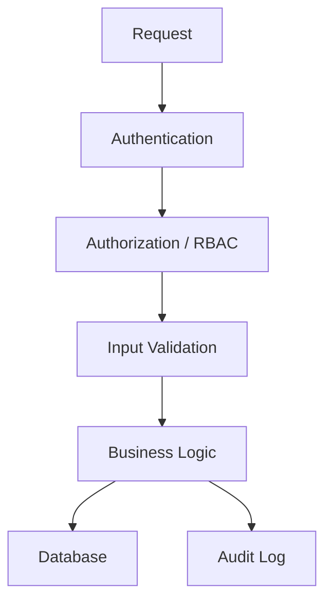
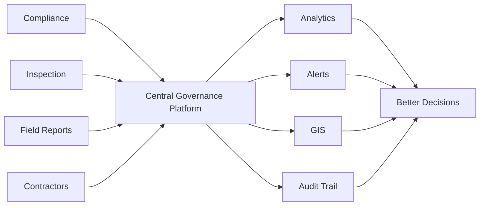
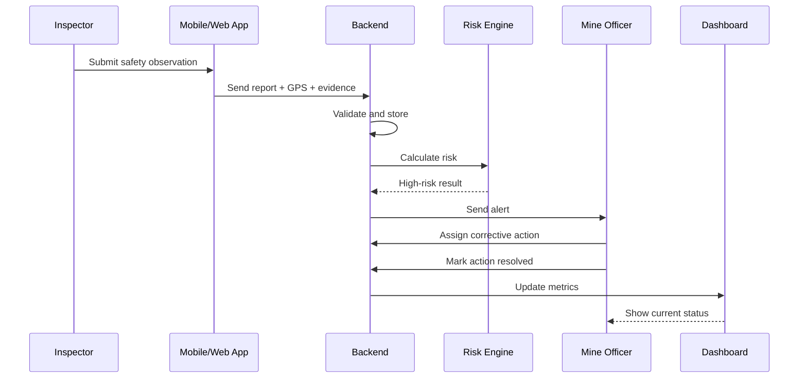

# Proposed Solution

## 1. Solution Overview

The proposed solution is a centralized **AI-Based Smart Governance & Compliance Monitoring Platform for Coal Mines**.

It connects mine-level field activities, statutory compliance, inspections, observations, corrective actions, contractor responsibilities, GIS information, alerts, analytics and management dashboards into one role-aware platform.

---

## 2. Solution in Simple Words

Think of the platform as a digital control room for mine governance.

Instead of asking:

> "Where is the latest report?"

the organization can ask:

> "What is overdue, what is high risk, who is responsible, what evidence exists, and what needs attention now?"

---

## 3. Core Architecture



---

## 4. Main Modules

### 4.1 Authentication & RBAC

Provides:

- login
- logout
- session/token management
- role-based authorization
- password security
- account status

Example roles:

- System Admin
- Mine Officer
- Field Inspector
- Department Officer
- Contractor
- Corporate Management
- Regulatory/Oversight
- Auditor

---

### 4.2 Mine Management

Stores:

- mine profile
- subsidiary/organization
- location
- departments
- responsible officers
- operational metadata

---

### 4.3 Compliance Management

A compliance item contains concepts such as:

- requirement
- category
- applicable mine
- due date
- responsible person
- status
- evidence
- verification
- escalation

Workflow:



---

## 5. Inspection Management

An inspection can include:

- mine
- inspector
- inspection type
- scheduled date
- actual date
- checklist
- observations
- photographs
- GPS coordinates
- severity
- comments
- corrective actions

Workflow:



---

## 6. Observation & Violation Management

Each observation can contain:

- category
- description
- severity
- location
- reporter
- timestamp
- evidence
- status
- responsible department
- risk score

Example severity:

```text
LOW
MEDIUM
HIGH
CRITICAL
```

---

## 7. Corrective Action Management

Corrective actions convert findings into accountable work.

```text
Open
  ↓
Assigned
  ↓
In Progress
  ↓
Resolved
  ↓
Verified
  ↓
Closed
```

If verification fails:

```text
Verified
   ↓
Rejected
   ↓
In Progress
```

This prevents a record from being permanently closed merely because someone marked it "resolved".

---

## 8. AI & Analytics Layer

The AI layer should be practical and explainable.

### Risk scoring

Example inputs:

- severity
- compliance criticality
- overdue duration
- recurrence
- affected area
- previous unresolved actions

Output:

```text
Risk Score: 87/100
Risk Level: HIGH
Reasons:
- Critical safety category
- Repeated occurrence
- Action overdue
```

This is more defensible in an SIH demo than showing an unexplained AI prediction.

---

## 9. Recurring Violation Detection

Example:



Example insight:

> "Barricade-related observations occurred repeatedly in the same operational area during the last reporting period."

---

## 10. GIS Module

The GIS dashboard can display:

- mine locations
- inspection locations
- observation locations
- high-risk hotspots
- corrective-action clusters



---

## 11. Mobile & Offline Reporting

Field inspectors should be able to:

- create reports
- capture photos
- capture GPS
- add comments
- save drafts
- continue without connectivity
- synchronize later



---

## 12. Automated Alerts

Alerts can be triggered by:

- approaching compliance deadline
- overdue compliance
- critical observation
- overdue corrective action
- repeated violation
- verification rejection
- unusual risk increase

Example:

```text
CRITICAL SAFETY OBSERVATION

Mine: Rajpur Coal Mine
Area: Restricted Zone A
Risk: 91/100
Action: Immediate review required
Responsible: Mine Safety Officer
```

---

## 13. Management Dashboard

The dashboard should prioritize exceptions.

Example metrics:

```text
Total Compliance Items       150
Compliant                    130
Pending                       13
Overdue                        7

Open Observations             24
High-Risk Observations         7

Corrective Actions             98
Completed                      86
Pending                        12
```

The numbers above are synthetic demo data.

---

## 14. Reporting

The system can generate:

- compliance reports
- inspection reports
- violation reports
- corrective-action reports
- risk reports
- mine-wise summaries
- date-range reports

Export options can include PDF/CSV depending on implementation phase.

---

## 15. Audit Trail

Important actions should create audit events.

Example:

```text
10:31 — Inspector created observation
10:32 — Risk engine calculated score
10:33 — Officer assigned corrective action
14:15 — Evidence uploaded
16:40 — Officer marked resolved
17:05 — Verifier rejected evidence
Next day — Action reopened
```

This creates a trustworthy history of what happened.

---

## 16. Security Model



Security controls:

- secure password hashing
- JWT expiration
- RBAC
- validation
- rate limiting
- secure headers
- CORS policy
- file validation
- secret management
- audit logs
- database access controls

---

## 17. Recommended Technology Stack

### Frontend

- React
- Vite
- Tailwind CSS
- React Router
- Axios
- Zustand
- Recharts
- Leaflet / React Leaflet

### Backend

- Node.js
- Express.js
- MongoDB
- Mongoose
- JWT
- bcrypt
- REST APIs

### Supporting Services

- Cloud/object storage for evidence
- Email/notification provider
- GIS/map provider
- Optional OCR/AI services

---

## 18. Why This Solution Is Different

The strongest differentiator is not one isolated AI model.

It is the **connected governance workflow**:



---

## 19. MVP

The first working version should include:

- authentication
- RBAC
- mine management
- compliance tracking
- inspections
- observations
- corrective actions
- dashboard
- alerts
- basic GIS
- explainable risk scoring

---

## 20. Advanced Version

After the core workflow is stable:

- offline mobile synchronization
- OCR
- advanced anomaly detection
- predictive ML
- multilingual assistant
- advanced GIS layers
- automated report generation
- integration APIs
- enterprise SSO
- scalable background processing

---

## 21. What We Should Not Overbuild Initially

Avoid starting with:

- blockchain
- microservices
- Kubernetes
- custom LLM training
- complex computer vision
- IoT hardware
- real-time streaming infrastructure

These can increase complexity without improving the first SIH demonstration.

---

## 22. End-to-End Demonstration



---

## 23. Final Solution Statement

> **A centralized, role-based and geo-aware governance platform that digitizes coal-mine compliance and inspection workflows, connects field evidence with management dashboards, automatically escalates important issues, and uses explainable analytics to identify high-risk and recurring problems.**

The solution is intentionally designed as a practical progression from **digital governance → connected workflows → analytics → intelligent decision support**.
